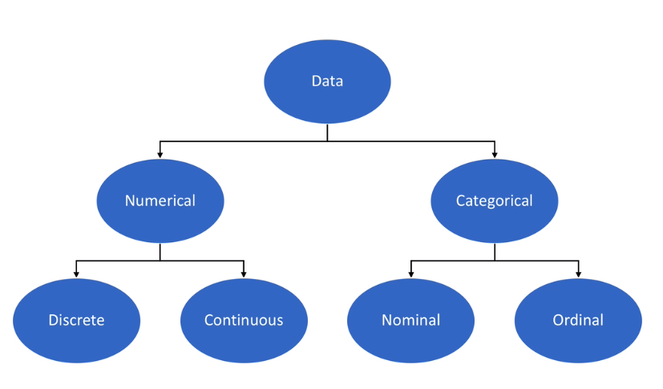

# This is Jeff's awesome website

What if I add some text here...?!!?


Here's a subsection

And here's some additional text...

```{r}
rnorm(10)
```

## links to other websites

let's link to useful tools for data science:

* [Google](https://www.google.com)
* [P8105](https://www.p8105.com)

## local image

Here's a screenshot of how data is categorized:



## link to page within the site

[About me](about.html)


